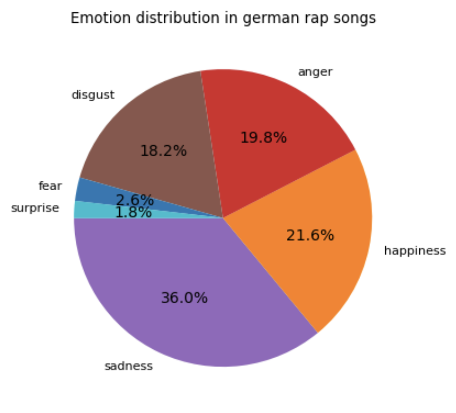

# sentiment-analysis-gpt

This repository contains all notebooks that were used to create the german rap sentiment dataset, detailed [Here](https://www.kaggle.com/datasets/mxgra93/german-rap-sentiment)

In order to use these notebooks, imported libraries as well as this [genius lyrics dataset](https://www.kaggle.com/datasets/carlosgdcj/genius-song-lyrics-with-language-information)
are needed.
- Dataset contains the preprocessing of the Genius Lyrics Dataset in order to extract only german rappers. These are further distilled down to 213 artists. This was important as I used the free trial of the openai api, which offers free 18$ of tokens.
- Working with GPT contains the main work for the final dataset. Here I loop through the new data and send it to gpt-3.5-turbo for analysis.
- Visualization contains just a few cells to draw the two graphs.

Please refer to the kaggle description for more information about the dataset.

